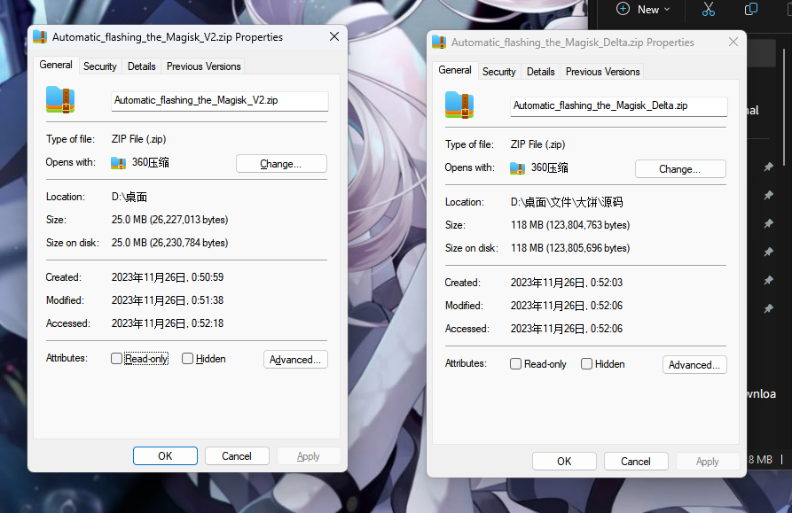

# **English** | [简体中文](README_CN.md) |

## Automatic_flashing_the_Magisk

 Can automatic flashing to topjohnwu's Magisk 
 but not English batch flies.....

## Features

 You can patch the boot image and flash it without installing Magisk Manager on your phone
 
 Relatively small storage size (compared to V1)
 

## System requirements

 A working PC with system is Windows 7 and above

## How to use it 

- Please enter the absolute path of your Payload.bin
- Now you can flash in with one click without environment variables (please don't delete the source folder!)
- Double-click the 开始.bat, select the flashing method according to the model, and then the phone can wait after turning on USB debugging and USB install in the boot state
- If there is no payload .bin, put boot into the boot directory ~
- **If there is an authorization window on your phone, please authorize, otherwise it will lead to failure!**

## Thanks

- [Magisk](https://github.com/topjohnwu/Magisk): Patch the boot's script
- [Android Debug Bridge](https://source.android.google.cn/docs/setup/build/adb?hl=zh-cn#download-adb): use the Android Debug Bridge flies
- [Aria2](https://github.com/aria2/aria2): use the aria2 to multi thead download flies
- [gitmirror](https://www.gitmirror.com/): provide Chinese Mainland users download speed up service
- [7zip](www.7-zip.org):Unzip the lib