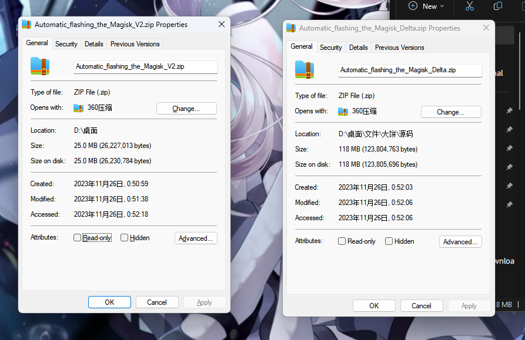

# [English](README.md) | **简体中文** |

## Automatic_flashing_the_Magisk

 可以在电脑上执行修补到刷入Magisk

## 特点

 可以在电脑上执行修补boot并刷入magisk而且和你得设备相吻合
 
 体积相对较少（与V1相比）

## 系统要求

 需要一个可以正常运行Windows7及以上操作系统的电脑

## 如何使用

- 请输入你Payload.bin的绝对路径
- 现在无需环境变量即可一键刷入(请不要删除source文件夹!)
- 双击开始.bat，按照机型选择刷入方式，然后手机在开机状态，开启了USB调试和USB安装之后即可等待
- 如果没有payload.bin，放入boot到此工具的boot目录即可~
- **手机上有授权窗口请授权，不然会导致失败！**

## 鸣谢

- [Magisk](https://github.com/topjohnwu/Magisk): 提供修补boot的脚本
- [Magisk_Delta](https://github.com/HuskyDG/magisk-files): 提供修补boot的脚本
- [Busybox](https://github.com/rmyorston/busybox-w32): 可以在Windows使用.sh的框架
- [Android Debug Bridge](https://source.android.google.cn/docs/setup/build/adb?hl=zh-cn#download-adb): 调用adb调试
- [Aria2](https://github.com/aria2/aria2):调用工具的多线程模式下载文件
- [gitmirror](https://www.gitmirror.com/):提供中国大陆用户的下载加速服务
